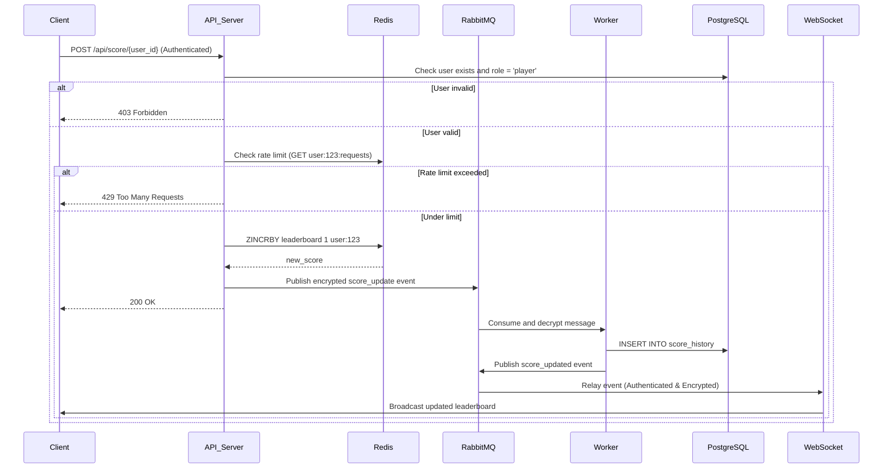

# Scoreboard API Service Module

## **Overview**
This module provides a real-time scoreboard system using **Redis** for instant updates, **RabbitMQ** for asynchronous processing, and **PostgreSQL** for persistent data storage. It ensures **high performance**, **data consistency**, and **robust security** to prevent unauthorized score manipulation.

---

## **Components**
1. **API Server**: Handles authenticated score updates and publishes events.  
2. **Redis**: Stores real-time leaderboard data in a sorted set.  
3. **RabbitMQ**: Manages asynchronous communication between services.  
4. **PostgreSQL**: Persists historical data for auditing and reconciliation.  
5. **WebSocket Server**: Broadcasts real-time leaderboard updates.  

---

## **API Endpoints**

### **1. Update User Score**
**Endpoint**: `POST /api/score/{user_id}`  
**Headers**:  
- `Authorization: Bearer <JWT_TOKEN>` (required)  
- `X-API-Key: <API_KEY>` (optional)  

**Request Body**:  
```json
{
  "increment": 1
}
```

**Workflow**:  
1. **Authentication & Authorization**:  
   - Validate JWT and check if the user ID in the token matches the request path.  
   - Verify the user exists in PostgreSQL and has the `player` role.  
2. **Anti-Replay Check**: Server generates a unique `request_id` and validates it.  
3. **Rate Limiting**: Track API calls in Redis (max 100 requests/user/minute).  
4. **Score Update**: Use `ZINCRBY` to atomically increment the score in Redis.  
5. **Event Publishing**: Send an encrypted event to RabbitMQ.  
6. **Response**: Return **200 OK** immediately.  

---

### **2. Get Leaderboard**
**Endpoint**: `GET /api/scores`  
**Response**:  
```json
{
  "data": [
    {"userId": "99", "username": "99tech_1", "rank": 1, "score": 100},
    {"userId": "98", "username": "99tech_2", "rank": 2, "score": 99}
  ],
  "cache_time": "2023-09-01T12:00:00Z"
}
```

**Optimization**: Results are cached in Redis for 5 seconds using `ZREVRANGE`.  

---

## **Data Storage**

### **Redis Schema**
- **Sorted Set Key**: `leaderboard`  
  - **Member**: `user:<user_id>`  
  - **Score**: Integer (cumulative points)  
- **Cache Key**: `cached_top_10` (TTL 5 seconds)  

#### **Key Redis Commands**
1. **Initialize User**:  
   ```bash
   ZADD leaderboard 0 user:123  # During user registration
   ```
2. **Update Score**:  
   ```bash
   ZINCRBY leaderboard 1 user:123  # Atomic increment
   ```
3. **Fetch Top 10**:  
   ```bash
   ZREVRANGE leaderboard 0 9 WITHSCORES  # Returns top 10 users
   ```
4. **Get User Rank**:  
   ```bash
   ZREVRANK leaderboard user:123  # Returns 0-based rank
   ```

### **PostgreSQL Schema**
```sql
CREATE TABLE users (
    user_id VARCHAR(36) PRIMARY KEY,
    username VARCHAR(50) UNIQUE NOT NULL,
    hashed_password VARCHAR(100) NOT NULL,
    api_key VARCHAR(64) UNIQUE NOT NULL,
    role VARCHAR(10) CHECK (role IN ('admin', 'player')) NOT NULL,
    created_at TIMESTAMP DEFAULT CURRENT_TIMESTAMP
);

CREATE TABLE score_history (
    id SERIAL PRIMARY KEY,
    request_id VARCHAR(36) UNIQUE NOT NULL,  -- Server-generated UUID
    user_id VARCHAR(36) REFERENCES users(user_id),
    increment INT NOT NULL CHECK (increment BETWEEN 1 AND 5),  -- Max +5 per action
    new_score INT NOT NULL,
    created_at TIMESTAMP DEFAULT CURRENT_TIMESTAMP
);
```

---

## **Security Measures**
1. **Authentication**: JWT validation for all requests.  
2. **Authorization**: Role-based access control (RBAC) – only `player` roles can update scores.  
3. **Anti-Gaming Protections**:  
   - **User Existence Check**: Verify the user exists in PostgreSQL before updating Redis.  
   - **Server-Generated `request_id`**: Prevents replay attacks.  
   - **Increment Validation**: Reject increments > 5.  
4. **Data Encryption**:  
   - TLS 1.3 for API, RabbitMQ, and WebSocket traffic.  
   - AES-256 encryption for message payloads.  
5. **Rate Limiting**:  
   - Redis-based sliding window counter (max 100 requests/user/minute).  

---

## **Message Queue (RabbitMQ)**

### **Queues & Messages**
- **Queue**: `score_history_queue` (durable, encrypted)  
- **Message Payload**:  
  ```json
  {
    "request_id": "server_generated_uuid4",
    "user_id": "123",
    "increment": 1,
    "new_score": 150,
    "encrypted_data": "aes256(...)"
  }
  ```

### **Worker Logic**
1. Decrypt and validate the message.  
2. Insert into `score_history` with server-generated `request_id`.  
3. Retry failed messages 3 times before moving to DLQ.  

---

## **Execution Flow Diagram**


---

## **Improvements for Security & Reliability**
1. **Data Consistency**:  
   - Daily reconciliation job to sync Redis and PostgreSQL.  
   ```sql
   -- Find discrepancies
   SELECT user_id, SUM(increment) AS sql_total 
   FROM score_history 
   GROUP BY user_id 
   HAVING sql_total != redis_score;
   ```
2. **Monitoring**:  
   - Prometheus/Grafana dashboards for Redis latency, PostgreSQL insertions, and RabbitMQ queue length.  
3. **Audit Logging**:  
   - Log all score updates to a separate `audit_log` table.  

---

## **Implementation Notes**
- **Redis Configuration**:  
  ```bash
  maxmemory-policy volatile-ttl
  requirepass your_secure_password
  ```
- **TLS Setup**:  
  - Enable TLS for RabbitMQ and API Server.  
- **WebSocket Authentication**:  
  ```javascript
  const ws = new WebSocket("wss://api.99tech.com", {
      headers: { "Authorization": "Bearer <JWT>" }
  });
  ```